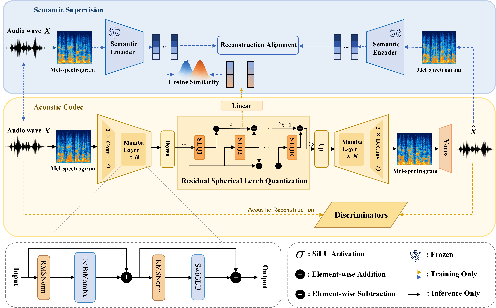

<div align="center">

# 🎙️ BiMTokenizer

### Bidirectional Mamba Speech Tokenizer for Low-Bitrate Neural Speech Coding

<p align="center">
  
</p>

<p>
  <a href="https://zhangxinwhut.github.io/BiMTokenizer/"></a>
  <a href="https://arxiv.org/abs/2609.00562"></a>
  <a href="https://huggingface.co/ZhangXinWhut/BiMTokenizer"></a>
</p>

*A bidirectional Mamba codec with residual spherical Leech quantization (RSLQ) for 16 kHz speech at ~1.1 kbps.*

</div>

---

## ✨ Highlights

- 🚀 **Low bitrate**: ~**1.1 kbps** at 16 kHz (12.5 Hz tokens × 5 codebooks)
- 🔊 **High-quality reconstruction** on LibriSpeech `test-clean` (WER **2.44%**, GT **2.16%**)
- 🧠 **Bidirectional Mamba** encoder / decoder (Mamba-1, `bimamba` v3)
- 🧊 **RSLQ**: 1 semantic layer + residual acoustic layers on a fixed Leech codebook

## 📊 Performance

### In-Domain Evaluation (LibriSpeech test-clean)

All results below are measured on LibriSpeech `test-clean` at 16 kHz. WER is measured with `hubert-large-ls960-ft`.

| Model | Codebook | Bitrate | SIM ↑ | STOI ↑ | PESQ-NB ↑ | PESQ-WB ↑ | UTMOS ↑ | WER ↓ |
|:------|:---------:|:-------:|:------:|:-------:|:----------:|:----------:|:--------:|:------:|
| Ground Truth | — | — | 1.00 | 1.00 | 4.55 | 4.64 | 4.09 | 2.16 |
| **BiMTokenizer-Whisper** | 196560 | 1100 bps | **0.87** | **0.95** | **3.56** | **3.03** | **4.21** | **2.44** |
| **BiMTokenizer-SenseVoice** | 196560 | 1100 bps | 0.85 | 0.94 | 3.45 | 2.85 | 4.18 | 2.53 |
| **BiMTokenizer-SenseVoice (32768+4096)** | 32768 + 4096 | 1087.5 bps | 0.86 | 0.943 | 3.459 | 2.893 | 4.20 | 2.48 |
| **BiMTokenizer-SenseVoice (8×2048)** | 8 × 2048 | 1100 bps | 0.87 | 0.94 | 3.46 | 2.89 | 4.15 | 2.52 |

### Comparison with Other Speech Tokenizers

The following comparison is also evaluated on LibriSpeech `test-clean`. `N_VQ` denotes the number of VQ codebooks; frame rate is reported in tokens per second.

#### 800–1100 bps

| Model | Bitrate | Frame rate | N_VQ | SIM ↑ | STOI ↑ | PESQ-NB ↑ | PESQ-WB ↑ |
|:------|--------:|-----------:|------:|------:|-------:|----------:|----------:|
| XCodec2.0 | 800 | 50 | 1 | 0.82 | 0.92 | 3.04 | 2.43 |
| MiMo-Audio-Tokenizer | 850 | 25 | 4 | 0.80 | 0.91 | 2.94 | 2.39 |
| Higgs-Audio-Tokenizer | 1000 | 25 | 4 | 0.77 | 0.83 | 3.03 | 2.48 |
| SpeechTokenizer | 1000 | 50 | 2 | 0.36 | 0.77 | 1.59 | 1.25 |
| XY-Tokenizer | 1000 | 12.5 | 8 | 0.85 | 0.92 | 3.10 | 2.50 |
| BigCodec | 1040 | 80 | 1 | 0.84 | 0.93 | 3.27 | 2.68 |
| Mimi | 1100 | 12.5 | 8 | 0.74 | 0.91 | 2.80 | 2.25 |
| MOSS-Audio-Tokenizer | 1000 | 12.5 | 8 | **0.88** | 0.94 | 3.38 | 2.87 |
| **BiMTokenizer** | **1100** | **12.5** | **8** | **0.88** | **0.95** | **3.62** | **3.06** |

#### 1500–2475 bps

| Model | Bitrate | Frame rate | N_VQ | SIM ↑ | STOI ↑ | PESQ-NB ↑ | PESQ-WB ↑ |
|:------|--------:|-----------:|------:|------:|-------:|----------:|----------:|
| DAC | 1500 | 75 | 2 | 0.48 | 0.83 | 1.87 | 1.48 |
| Encodec | 1500 | 75 | 2 | 0.60 | 0.85 | 1.94 | 1.56 |
| Higgs-Audio-Tokenizer | 2000 | 25 | 8 | 0.90 | 0.85 | 3.59 | 3.11 |
| SpeechTokenizer | 2000 | 50 | 4 | 0.66 | 0.88 | 2.38 | 1.92 |
| Qwen3-TTS-Tokenizer | 2200 | 12.5 | 16 | **0.95** | 0.96 | 3.66 | 3.19 |
| MiMo-Audio-Tokenizer | 2250 | 25 | 12 | 0.89 | 0.95 | 3.57 | 3.05 |
| Mimi | 2475 | 12.5 | 18 | 0.89 | 0.94 | 3.49 | 2.97 |
| MOSS-Audio-Tokenizer | 2000 | 12.5 | 16 | **0.95** | 0.96 | 3.78 | 3.41 |
| **BiMTokenizer** | **2200** | **12.5** | **16** | 0.94 | **0.97** | **3.92** | **3.46** |

## 🚀 Quick Start

### Installation

```bash
git clone https://github.com/ZhangXinWhut/BiMTokenizer.git && cd BiMTokenizer

conda create -n bimtokenizer python=3.10 -y && conda activate bimtokenizer
pip install -r requirements.txt
```

`causal_conv1d` and `mamba_ssm` are **not** in `requirements.txt`. Compile them from GitHub for your GPU (do not install PyPI wheels):

| GPU | Arch | causal-conv1d | mamba-ssm |
|-----|------|---------------|-----------|
| NVIDIA H100 | `9.0` | v1.5.2 | v2.2.5 |
| GeForce RTX 5090 | `12.0` | v1.5.4 | v2.2.6 |

```bash
# H100
bash install_causal_conv1d.sh h100
bash install_mamba_ssm.sh h100

# RTX 5090
bash install_causal_conv1d.sh 5090
bash install_mamba_ssm.sh 5090
```

Python **3.10**, CUDA **12.8**, PyTorch **2.8.0**. Details: [INSTALL.md](INSTALL.md).

```bash
python -c "import torch, causal_conv1d, mamba_ssm; print(torch.cuda.get_device_name(0))"
```

## Available Models 🗂️

The following five checkpoints are available on [Hugging Face](https://huggingface.co/ZhangXinWhut/BiMTokenizer):

| Model | Checkpoint | Quantizer | Bitrate |
|:------|:-----------|:----------|:-------:|
| BiMTokenizer-Whisper | [`bimtokenizer_whisper_librispeech.pt`](https://huggingface.co/ZhangXinWhut/BiMTokenizer/blob/main/whisper/bimtokenizer_whisper_librispeech.pt) | RSLQ, 5 × 196560 | 1100 bps |
| BiMTokenizer-SenseVoice | [`bimtokenizer_sensevoice_librispeech.pt`](https://huggingface.co/ZhangXinWhut/BiMTokenizer/blob/main/sensevoice/bimtokenizer_sensevoice_librispeech.pt) | RSLQ, 5 × 196560 | 1100 bps |
| BiMTokenizer-SenseVoice (32768+4096) | [`bimtokenizer_sensevoice_32768_4096_librispeech.pt`](https://huggingface.co/ZhangXinWhut/BiMTokenizer/blob/main/sensevoice-32768-4096/bimtokenizer_sensevoice_32768_4096_librispeech.pt) | 32768 + 4096 | 1087.5 bps |
| BiMTokenizer-SenseVoice (8×2048) | [`bimtokenizer_sensevoice_2048_librispeech.pt`](https://huggingface.co/ZhangXinWhut/BiMTokenizer/blob/main/sensevoice-2048/bimtokenizer_sensevoice_2048_librispeech.pt) | RSLQ-no-scale, 8 × 2048 | 1100 bps |
| BiMTokenizer-SenseVoice (16×2048) | [`bimtokenizer_sensevoice_2048_emilia2w.pt`](https://huggingface.co/ZhangXinWhut/BiMTokenizer/blob/main/sensevoice-2048/bimtokenizer_sensevoice_2048_emilia2w.pt) | RSLQ-no-scale, 16 × 2048 | 2200 bps |

Codebooks are loaded from `bimtokenizer/modules/quantizer/cache/*.npy` (not stored inside the `.pt` file).

### Download Model Weights

Download all checkpoints and their configurations from Hugging Face:

```bash
huggingface-cli download ZhangXinWhut/BiMTokenizer \
  --local-dir ./weights/BiMTokenizer
```

### Inference

```bash
python inference.py \
  --config_path config/bimtokenizer_whisper_librispeech.yaml \
  --checkpoint_path weights/BiMTokenizer/whisper/bimtokenizer_whisper_librispeech.pt \
  --input_dir /path/to/LibriSpeech/test-clean \
  --output_dir output_wavs \
  --device cuda --batch_size 1
```

Reconstructed wavs are written to `--output_dir` (default `output_wavs/`).

To run the Emilia-2W checkpoint with a selectable number of codebooks:

```bash
python inference.py \
  --config_path config/bimtokenizer_sensevoice_2048_emilia2w.yaml \
  --checkpoint_path weights/BiMTokenizer/sensevoice-2048/bimtokenizer_sensevoice_2048_emilia2w.pt \
  --n_codebooks 16 \
  --input_dir /path/to/LibriSpeech/test-clean \
  --output_dir output_wavs \
  --device cuda --batch_size 1
```

## 🙏 Acknowledgements

This project builds on [Vim](https://github.com/hustvl/Vim) and
[npq-vit](https://github.com/zhaoyue-zephyrus/npq-vit). We thank their authors
for making their work publicly available.

## 📝 Citation

If you find this work useful in your research, please cite our paper:

```bibtex
@misc{zhang2026bimtokenizerpreservingsemanticacousticbalance,
  title={BiMTokenizer: Preserving Semantic-Acoustic Balance in Low-Bitrate Speech Tokenization via Bidirectional State-Space Modeling},
  author={Xin Zhang and Lin Li and Chuanbo Liu and Jianquan Liu and Kong Aik Lee},
  year={2026},
  eprint={2609.00562},
  archivePrefix={arXiv},
  primaryClass={cs.SD},
  url={https://arxiv.org/abs/2609.00562}
}
```

## 📜 License

This project is licensed under the [Apache License 2.0](LICENSE).
